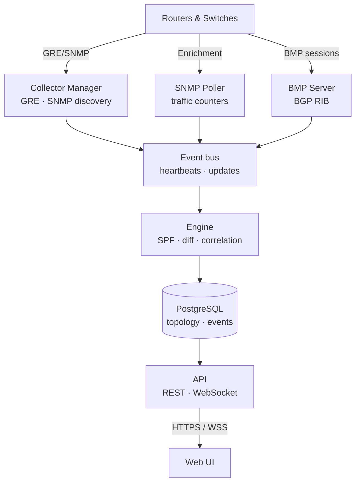

# Osprey

**Real-time network visibility & engineering for OSPF, IS-IS, BGP, and MPLS**

Osprey passively discovers your routing infrastructure, builds a protocol-accurate
model of every IGP area, and gives your engineering team one place to understand,
simulate, and troubleshoot the network. No agents on routers. No route injection.
No risk.

[Website](https://www.wijnberg.net/osprey) ·
[Documentation](https://www.wijnberg.net/osprey/docs) ·
[Download](https://github.com/wijnberg-net/osprey/releases/latest) ·
[Licensing](mailto:sales@wijnberg.net)

---

## Why Osprey

Network engineers run complex multi-protocol topologies with limited visibility.
Troubleshooting a convergence event means correlating CLI output across dozens of
routers. Planning a maintenance window means guessing which traffic shifts will
occur. Understanding "what happened at 3 AM" means hoping someone captured the
right data.

Osprey observes IGP topology in real time through passive GRE adjacencies, SNMP
polling, and BMP sessions. It reconstructs the full link-state database for every
protocol instance, computes shortest paths exactly as your routers do, and presents
it through an interactive web interface with simulation, time travel, and incident
correlation built in.

- **Simulate before you change** — fail links, remove devices, adjust metrics, and
  define SRLG groups against live topology. Server-side SPF computes the resulting
  traffic shifts, flags newly isolated devices, and surfaces congestion risk —
  before you touch production.
- **Replay any moment** — Time Travel reconstructs topology at any point in history
  with transport-style playback. Combined with automatic incident correlation,
  trace exactly how an event unfolded and verify a change had the intended effect.
- **Multi-protocol, multi-AF paths** — OSPFv2, OSPFv3, IS-IS (CLNS addressing and
  SR-MPLS), BGP via BMP, and L2 via LLDP/CDP, correlated on one canvas. IS-IS
  multi-AF gives independent SPF per address family. BGP RIB analysis shows every
  path per prefix across all BMP targets — like `show ip bgp`, network-wide.
- **Watch BGP and MPLS change over time** — an animated AS-flow view morphs the
  inter-AS graph as routing shifts, with per-AS drill-down, a T1↔T2 movers diff,
  and prefix-level change replay; historical BGP shows the real as-of-time
  best-paths in time travel. MPLS-TE tunnels and L3VPNs discovered from the
  routers overlay directly on the topology, so a rerouted tunnel or a downed VRF
  appears exactly where the failure is.
- **Zero footprint** — GRE collectors form read-only IGP adjacencies (high cost,
  priority 0) and never influence SPF or forwarding. SNMP polls counters and L2
  neighbors. BMP targets push RIB updates. The network does not know Osprey is
  watching.

---

## Download & install

Grab the latest `.deb` from the
[Releases page](https://github.com/wijnberg-net/osprey/releases/latest), verify it,
and install:

```bash
# Download the latest release + checksum
curl -LO https://github.com/wijnberg-net/osprey/releases/latest/download/osprey_amd64.deb
curl -LO https://github.com/wijnberg-net/osprey/releases/latest/download/SHA256SUMS

# Verify integrity
sha256sum -c SHA256SUMS

# Install — pulls PostgreSQL, NATS, and nginx as dependencies
sudo apt install ./osprey_amd64.deb
```

Migrations run automatically, all services start under systemd, and a self-signed
TLS certificate is generated on first install. Open **https://your-server/** and log
in with the admin account created during setup.

**Supported platforms:** Debian 12+, Ubuntu 24.04+. Runs on bare metal, Proxmox LXC
(privileged and unprivileged), and VMs.

### Free evaluation

All features, up to 32 devices, no time limit, no license key required. Upgrade by
uploading a license key through the web UI. For Professional or Enterprise
licensing, contact **[sales@wijnberg.net](mailto:sales@wijnberg.net)**.

---

## Protocol support

| Protocol   | Discovery method   | Capabilities |
|------------|--------------------|--------------|
| **OSPFv2** | GRE adjacency, SNMP | Full LSDB, SPF, inter-area and external routes, traffic counters |
| **OSPFv3** | GRE adjacency, SNMP | Full LSDB, dual-stack, RFC 5838 address families |
| **IS-IS**  | GRE adjacency, SNMP | Full LSDB, CLNS/IPv4/IPv6 multi-AF SPF, SR-MPLS, dual-stack, single-seed multi-area discovery, Cisco IOS GRE interop |
| **BGP**    | BMP (RFC 7854)      | Full RIB, all paths per prefix, ADD-PATH, peer state, historical as-of-T replay, AS-flow animation |
| **MPLS**   | SNMP (MPLS-TE / MPLS-L3VPN MIBs) | TE tunnels (RFC 3812), L3VPNs (RFC 4364 / 4382) with VRF & route-target rollup |
| **L2**     | SNMP (LLDP/CDP)     | Switch adjacencies, BFS crawling, overlay on IGP topology |

---

## Features

### Topology visualization
- Interactive canvas with area coloring, vendor icons, and real-time updates
- Area-cloud overview for large multi-area topologies, expandable in place to drill down
- Desktop-style panel manager: compare devices and links side-by-side without losing context
- Multi-protocol link merge: OSPFv2, OSPFv3, and IS-IS on the same wire shown as one edge with per-protocol detail
- L2 overlay: LLDP/CDP switch adjacencies rendered alongside IGP topology
- Export to Visio (.vsdx) reproducing the canvas closely — curved links, edge-label chips, area hulls — plus PNG and SVG, with importable vendor stencil packs
- Multiple visual themes, including dark, high contrast (WCAG AAA), and retro
- Responsive layout for phones and tablets; the desktop layout is unchanged

### Traffic monitoring
- SNMP v2c/v3 polling: per-interface utilization, errors, bandwidth, vendor detection
- On-demand 5-second boost polling when inspecting a link
- Traffic graphs with hourly history (24h, 7d, 30d, 1y)
- Congestion and error alerting with sustained-sample filtering

### Route analysis
- Shortest-path computation with ECMP and asymmetric-routing detection
- IS-IS address-family selector with per-AF traceroute (CLNS shows System IDs and NETs)
- SR-MPLS label-stack computation (RFC 8667)
- Per-router routing table with step-by-step cost explanation
- BGP prefix search (exact, longest-match, covered) with CSV export
- SPF tree visualization from any device with cost annotations

### BGP analysis
- Full RIB per prefix across every BMP target — all paths, ADD-PATH, best-path selection — like `show ip bgp`, network-wide
- AS-Flow view: an interactive inter-AS graph where autonomous systems are sized bubbles and AS-path adjacencies are animated flows; scrub a timeline, play the reflow, diff two instants with a movers breakdown, and drill into any AS for share, churn, sole-path vs backup dependency, exit routers, and session health — full-table (DFZ) safe
- Change replay: step, animate, and diff a single prefix's best-path history on the timeline — watch exit points shift, sessions flap, and paths re-home
- Historical BGP: time travel shows the real as-of-time best-paths and peer sessions, and evaluates hot-potato exit shifts and peer-failure impact as of the selected instant
- Peer session monitoring via BMP with up/down history and per-target prefix counts

### MPLS visibility
- MPLS-TE tunnels (RFC 3812) discovered by SNMP: role (head / transit / tail), admin/oper state, and an abstract headend-to-tailend arc on the canvas (marching ants when up, broken red dash when down) — an overlay plane that makes no claim to trace the hop-by-hop path
- MPLS L3VPNs (RFC 4364 / 4382): per-PE VRFs rolled up server-side into L3VPNs by route-target, with automatic full-mesh vs hub-and-spoke classification and per-site hub / spoke roles
- L3VPN overlay: selecting an L3VPN highlights its PE sites and draws membership edges (a full interconnect for mesh, a star from the hub for hub-spoke), with an honesty ribbon — the arcs show control-plane VPN membership, not the data path
- MPLS discovery rides a per-network **auto | on | off** toggle and a capability probe, so only routers that actually run MPLS are walked; tunnel reroutes and VRF-down events feed incident correlation as symptoms, never root causes

### Failure simulation
- Simulate link failures, node removals, metric changes, hypothetical links/routers, SRLG failures
- Traffic-shift impact analysis with congestion-risk classification
- Batch assessment: iterate all links or nodes, surface only failures that cause isolation
- Shareable scenarios with undo/redo, applicable to historical snapshots via time travel

### History and diagnostics
- Time Travel with playback controls and timeline scrubber
- Topology Diff: compare two points in time with an added/removed/changed summary
- Incident-correlation engine: related events grouped with inferred root causes
- LSDB browser with LSA headers, age indicators, and Options-flag decoding
- Diagnostic reports: timer consistency, MTU mismatch, congestion trends, routing stability, single points of failure

### Administration
- Role-based access control (admin, engineer, operator)
- Browser-based SSH/Telnet terminal with encrypted session recording and full audit trail
- Alert rules with Slack, Teams, email, and webhook notifications
- Maintenance windows for scheduled alert suppression
- SNMP credential profiles with per-network overrides and fallback credentials
- Backup/restore, audit logging, encrypted credential storage, license management
- Update notification: checks for a newer release on startup and prompts when one is available

---

## Architecture

A single binary runs five services under `osprey.target`:



Data flows one direction: collectors and BMP ingest protocol data and publish to an
internal event bus, the engine persists to PostgreSQL, and the API serves the
frontend. No service calls back upstream. PostgreSQL is the only datastore — no JVM,
no Elasticsearch, no graph database.

## Scale

Tested in production with 500+ devices across OSPF and IS-IS; designed for 5,000+
with sub-10 ms search. SNMP counter polling defaults to 5-minute intervals with
configurable per-target overrides and a 6-hour interface-discovery cycle.

---

## Documentation

Full documentation — installation, canvas, reports, simulation, administration, and
troubleshooting — lives at **[www.wijnberg.net/osprey/docs](https://www.wijnberg.net/osprey/docs)**.

---

## License

Proprietary. Copyright © 2025–2026 Michel Wijnberg. All rights reserved. See
[LICENSE](LICENSE).

Free evaluation: all features, up to 32 devices, no time limit. Production
licensing: **[sales@wijnberg.net](mailto:sales@wijnberg.net)**. Full terms:
[www.wijnberg.net/osprey/terms](https://www.wijnberg.net/osprey/terms).

The distributed binary includes third-party open-source components under their
respective licenses; see [THIRD-PARTY-LICENSES.txt](THIRD-PARTY-LICENSES.txt).

<details>
<summary>Protocol references</summary>

**OSPF**: RFC 2328 (v2), RFC 5340 (v3), RFC 5838 (AF extensions), RFC 7474 (SHA-HMAC).
**IS-IS**: ISO 10589, RFC 1195, RFC 5301 (hostname), RFC 5303 (3-way), RFC 5305 (TE), RFC 8667 (SR-MPLS).
**BGP/BMP**: RFC 4271 (BGP-4), RFC 4760 (MP-BGP), RFC 6793 (4-byte ASN), RFC 7854 (BMP), RFC 7911 (Add-Path), RFC 8654 (Extended Messages).
**MPLS**: RFC 3812 (TE MIB), RFC 4364 (BGP/MPLS IP VPNs), RFC 4382 (L3VPN MIB).
**L2**: IEEE 802.1AB (LLDP), Cisco CDP.

</details>
