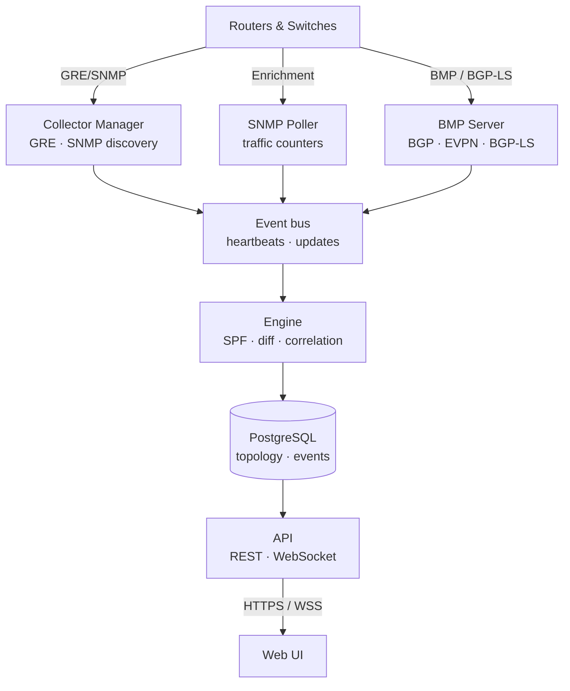

# Osprey

**Real-time network visibility & engineering for OSPF, IS-IS, EIGRP, BGP, MPLS, and EVPN**

Osprey passively discovers your routing infrastructure, builds a protocol-accurate
model of every IGP area, and gives your engineering team one place to understand,
simulate, and troubleshoot the network. No agents on routers. No route injection.
Never a transit path.

[Website](https://www.wijnberg.net/) ·
[Documentation](https://www.wijnberg.net/docs/) ·
[Download](https://github.com/wijnberg-net/osprey/releases/latest) ·
[Licensing](mailto:sales@wijnberg.net)

---


## Why Osprey

Network engineers run complex multi-protocol topologies with limited visibility.
Troubleshooting a convergence event means correlating CLI output across dozens of
routers. Planning a maintenance window means guessing which traffic shifts will
occur. Understanding "what happened at 3 AM" means hoping someone captured the
right data.

Osprey observes IGP topology in real time through passive GRE adjacencies, SNMP
polling, BMP sessions, and BGP-LS. It reconstructs the OSPF and IS-IS
link-state databases in full, models EIGRP from the routers' own topology tables,
computes shortest paths exactly as your routers do, and
presents it through an interactive web interface with simulation, time travel, and
incident correlation built in.

- **Simulate before you change** — fail links, remove devices, adjust metrics, and
  define SRLG groups against live topology. Server-side SPF computes the resulting
  traffic shifts, flags newly isolated devices, and surfaces congestion risk —
  before you touch the live network.
- **Replay any retained moment** — Time Travel reconstructs topology at any point
  inside the snapshot retention window
  with transport-style playback. Combined with automatic incident correlation,
  trace exactly how an event unfolded and verify a change had the intended effect.
- **Multi-protocol, multi-AF paths** — OSPFv2, OSPFv3, IS-IS (CLNS addressing and
  SR-MPLS), EIGRP, BGP via BMP, and L2 via LLDP/CDP, correlated on one canvas. IS-IS
  multi-AF gives independent SPF per address family. BGP RIB analysis shows every
  path per prefix across all BMP targets — like `show ip bgp`, network-wide.
- **See areas you cannot reach** — where a protocol adjacency is politically or
  technically impossible, BGP-LS (RFC 9552) has the routers export their own link-state
  database instead: mirrored over an existing BMP session, or over a receive-only peering
  Osprey dials out. Every link and device records how it was learned — read from a
  link-state database, reported by a MIB, or exported by a router — so the map never
  hides which parts are first-hand.
- **Watch BGP and MPLS change over time** — an animated AS-flow view morphs the
  inter-AS graph as routing shifts, with per-AS drill-down, a T1↔T2 movers diff,
  and prefix-level change replay; historical BGP shows the real as-of-time
  best-paths in time travel. MPLS-TE tunnels, L3VPNs, L2VPN pseudowires (VPWS
  wires and VPLS meshes), and BGP-EVPN instances discovered from the routers
  overlay directly on the topology, so a rerouted tunnel, a downed VRF, or a
  torn pseudowire appears exactly where the failure is.
- **Never in the forwarding path** — GRE collectors form read-only IGP adjacencies
  and originate a single max-cost Router-LSA (IS-IS: the overload bit), which is
  precisely what makes them unusable as transit. Like any adjacency they are visible
  in the link-state database and are an input to SPF; what they can never be is a
  path a packet takes. SNMP polls counters and L2 neighbors. BMP targets push RIB
  updates. BGP-LS peering is receive-only by construction: Osprey never listens,
  always dials, and its wire layer can serialise nothing but OPEN, KEEPALIVE, and
  NOTIFICATION — it cannot send an UPDATE even by mistake. Nothing Osprey does can
  move a packet.

---

## Download & install

Grab the latest `.deb` from the
[Releases page](https://github.com/wijnberg-net/osprey/releases/latest), verify it,
and install:

```bash
# Download the latest release + checksum
curl -LO https://github.com/wijnberg-net/osprey/releases/latest/download/osprey_amd64.deb
curl -LO https://github.com/wijnberg-net/osprey/releases/latest/download/SHA256SUMS

# Verify integrity
sha256sum -c SHA256SUMS

# Install — pulls PostgreSQL, NATS, and nginx as dependencies
sudo apt install ./osprey_amd64.deb
```

Migrations run automatically, all services start under systemd, and a self-signed
TLS certificate is generated on first install. Open **https://your-server/** and log
in with the admin account created during setup.

**Supported platforms:** Debian 12+, Ubuntu 24.04+. Runs on bare metal, Proxmox LXC
(privileged and unprivileged), and VMs.

### Free evaluation

All features, up to 32 devices, no time limit, no license key required. Upgrade by
uploading a license key through the web UI. For Professional or Enterprise
licensing, contact **[sales@wijnberg.net](mailto:sales@wijnberg.net)**.

---

## Protocol support

| Protocol   | Discovery method   | Capabilities |
|------------|--------------------|--------------|
| **OSPFv2** | GRE adjacency, SNMP | Full LSDB, SPF, inter-area and external routes, traffic counters |
| **OSPFv3** | GRE adjacency, SNMP | Full LSDB, dual-stack, RFC 5838 address families |
| **IS-IS**  | GRE adjacency, SNMP | Full LSDB, CLNS/IPv4/IPv6 multi-AF SPF, SR-MPLS, dual-stack, single-seed multi-area discovery that provisions one strict recorder per area and hands them over, Cisco IOS GRE interop |
| **EIGRP**  | SNMP (CISCO-EIGRP-MIB) | Passive neighbor & interface discovery (IPv4 + IPv6, classic & named mode, per VRF/AS), topology stitched onto the L2 fabric, observed forwarding paths with real composite metrics (FD), administrative distance, and adjacency-loss alerting — Cisco only, read-only, no adjacency formed |
| **BGP**    | BMP (RFC 7854)      | Full RIB, all paths per prefix, ADD-PATH, peer state, historical as-of-T replay, AS-flow animation |
| **BGP-LS** | BMP lane or receive-only peer (RFC 9552) | Link-state topology exported by the routers themselves, projected onto the canvas like a recorder-fed area; stands down automatically where a real recorder already feeds that area; refuses to draw a partial graph rather than a wrong one |
| **EVPN**   | BMP (RFC 7432)      | E-LAN & EVPN-VPWS instances (VXLAN or MPLS), member PEs with MAC/IP counts, Ethernet segments, MAC-mobility & PE-loss detection |
| **MPLS**   | SNMP (MPLS-TE / L3VPN / PW MIBs) | TE tunnels (RFC 3812), L3VPNs (RFC 4364 / 4382) with VRF & route-target rollup, pseudowires (RFC 5601) rolled up into VPWS wires & VPLS instances |
| **L2**     | SNMP (LLDP/CDP)     | Switch adjacencies, BFS crawling, overlay on IGP topology |

---

## Features

### Topology visualization
- Interactive canvas with area coloring, vendor icons, and real-time updates
- Area-cloud overview for large multi-area topologies, expandable in place to drill down
- Desktop-style panel manager: compare devices and links side-by-side without losing context
- Multi-protocol link merge: OSPFv2, OSPFv3, IS-IS, and EIGRP on the same wire shown as one edge with per-protocol detail
- L2 overlay: LLDP/CDP switch adjacencies rendered alongside IGP topology
- Evidence provenance on every link and device — read from a link-state database, reported by a MIB, or exported by a router — shown in the detail drawers
- Export to Visio (.vsdx) reproducing the canvas closely — curved links, edge-label chips, area hulls — plus PNG and SVG, with importable vendor stencil packs
- Multiple visual themes, including dark, high contrast, and retro
- Responsive layout for phones and tablets; the desktop layout is unchanged

### Traffic monitoring
- SNMP v2c/v3 polling: per-interface utilization, errors, bandwidth, vendor detection
- On-demand 5-second boost polling when inspecting a link
- Traffic graphs with hourly history (24h, 7d, 30d, 1y)
- Congestion and error alerting with sustained-sample filtering

### Route analysis
- **Hop-by-hop forwarding paths** — every hop is that router's *own* routing-table decision, not the source's shortest-path view, so the drawn path is the one the packet takes — where per-router evidence reaches that far. Where it does not (some OSPFv3 and IS-IS paths, or a selection holding only part of a protocol instance), Osprey falls back to the shortest-path view and labels the answer as exactly that. Each hop shows its metric, route type and installed ECMP set
- **Cross-domain paths** — a path that leaves one routing domain is stitched across ASes and tenants using BGP evidence, with per-segment costs and honest confidence (resolved / inferred / opaque) rather than a guess
- Shortest-path computation with the full equal-cost path set and asymmetric-routing detection
- IS-IS address-family selector with per-AF traceroute (CLNS shows System IDs and NETs)
- SR-MPLS label-stack computation (RFC 8667)
- Per-router routing table with step-by-step cost explanation
- BGP prefix search (exact, longest-match, covered) with CSV export
- SPF tree visualization from any device with cost annotations

### BGP analysis
- Full RIB per prefix across every BMP target — all paths, ADD-PATH, best-path selection — like `show ip bgp`, network-wide
- AS-Flow view: an interactive inter-AS graph where autonomous systems are sized bubbles and AS-path adjacencies are animated flows; scrub a timeline, play the reflow, diff two instants with a movers breakdown, and drill into any AS for share, churn, sole-path vs backup dependency, exit routers, and session health — full-table (DFZ) safe
- Change replay: step, animate, and diff a single prefix's best-path history on the timeline — watch exit points shift, sessions flap, and paths re-home
- Historical BGP: time travel shows the real as-of-time best-paths and peer sessions, and evaluates hot-potato exit shifts and peer-failure impact as of the selected instant
- **BGP security findings over what your sessions were offered** — three deterministic checks, no baselining and no scores: a prefix left with multiple offered origins, a more-specific under another origin's covering prefix, and a path already carrying your own AS. Every finding names the vantage sessions it was seen on, and an empty report under incomplete coverage reads as a coverage statement, not an all-clear
- **RPKI/ROA validation against an authorization set you import** — RFC 6811 validation at read time, badging each offered path valid / invalid / unknown, with historical candidates validated against the authorizations as they stood at the time. With no ROAs loaded there is no badge at all, because an "unknown" everywhere would imply validation is running
- Peer session monitoring via BMP with up/down history and per-target prefix counts

### MPLS & EVPN service visibility
- MPLS-TE tunnels (RFC 3812) discovered by SNMP: role (head / transit / tail), admin/oper state, and an abstract headend-to-tailend arc on the canvas (marching ants when up, broken red dash when down) — an overlay plane that makes no claim to trace the hop-by-hop path
- MPLS L3VPNs (RFC 4364 / 4382): per-PE VRFs rolled up server-side into L3VPNs by route-target, with automatic full-mesh vs hub-and-spoke classification and per-site hub / spoke roles
- MPLS L2VPN (VPWS & VPLS): pseudowires walked per PE via the PW MIBs (RFC 5601, with a per-device fallback driver) and rolled up into end-to-end VPWS wires — including honest half-wires when the far end is outside the monitored network — and VPLS instances with a mesh-completeness badge (full / partial / unknown), each with a live browser panel and canvas overlay
- EVPN via BMP (RFC 7432): E-LAN and EVPN-VPWS instances discovered straight from the BGP feed (VXLAN or MPLS encapsulation), with observations from redundant route reflectors collapsed into one canonical instance; the EVI browser lists member PEs with per-PE MAC/IP counts, Ethernet Segments, and on-map / off-view placement, and draws membership edges on the canvas
- EVPN MAC mobility and PE loss as correlated symptoms: host moves are detected via the MAC-Mobility sequence (with an all-active multihoming guard, so normal redundancy never fires false moves) and storm-guarded; both attach to the co-incident device or link failure, never opening incidents of their own
- Selecting any service highlights its PEs and draws membership edges (a full interconnect for mesh, a star from the hub for hub-spoke) in the route path's visual language — same stroke, same marching-ants motion when up, clearly distinct broken dash when down or partial — with honesty ribbons: the arcs show control-plane membership, not the data path
- MPLS discovery rides a per-network **on | off** toggle (off by default) and a capability probe, so only routers that actually run MPLS are walked; tunnel reroutes, VRF-down and pseudowire-down events feed incident correlation as symptoms, never root causes

### Failure simulation
- Simulate link failures, node removals, metric changes, hypothetical links/routers, SRLG failures
- Traffic-shift impact analysis with congestion-risk classification
- Batch assessment: iterate all links or nodes, surface only failures that cause isolation
- Shareable scenarios with undo/redo, applicable to historical snapshots via time travel

### History and diagnostics
- Time Travel with playback controls and timeline scrubber, bounded by the configured snapshot retention window
- Topology Diff: compare two points in time with an added/removed/changed summary
- Incident-correlation engine: related events grouped with inferred root causes
- LSDB browser with LSA headers, age indicators, and Options-flag decoding
- Diagnostic reports: timer consistency, MTU mismatch, congestion trends, routing stability, single points of failure

### Administration
- **Enterprise sign-on** — OpenID Connect SSO, LDAP / Active Directory, SAML 2.0, and SCIM 2.0 user provisioning; two-factor authentication (TOTP) for local accounts
- Role-based access control (admin, engineer, operator)
- Browser-based SSH/Telnet terminal with encrypted session recording and full audit trail
- Alert rules with Slack, Teams, email, and webhook notifications
- Maintenance windows for scheduled alert suppression
- SNMP credential profiles with per-network overrides and fallback credentials
- Backup/restore, audit logging, encrypted credential storage, license management
- Update notification: checks for a newer release on startup and prompts when one is available

---

## Architecture

A single binary runs five services under `osprey.target`:



Topology flows one direction: collectors and BMP ingest protocol data and publish
to an internal event bus, the engine persists to PostgreSQL, and the API serves the
frontend — no collector writes topology, and no service calls back upstream. SNMP
enrichment (interfaces, L2 neighbors, MPLS services) writes its own rows directly,
alongside that path rather than through it. PostgreSQL is the only datastore — no JVM,
no Elasticsearch, no graph database.

## Scale

PostgreSQL, the engine, and the event bus carry device counts well past what a
single full-network canvas can usefully draw — the practical ceiling is rendering,
which is why per-area views are the working surface on large topologies. SNMP
counter polling defaults to 5-minute intervals with configurable
per-target overrides and a 6-hour interface-discovery cycle.

---

## Documentation

Full documentation — installation, canvas, reports, simulation, administration, and
troubleshooting — lives at **[www.wijnberg.net/docs](https://www.wijnberg.net/docs/)**.

---

## License

Proprietary. Copyright © 2025–2026 Michel Wijnberg. All rights reserved. See
[LICENSE](LICENSE).

Free evaluation: all features, up to 32 devices, no time limit. Commercial
licensing: **[sales@wijnberg.net](mailto:sales@wijnberg.net)**. Full terms:
[www.wijnberg.net/terms](https://www.wijnberg.net/terms/).

The distributed binary includes third-party open-source components under their
respective licenses; see [THIRD-PARTY-LICENSES.txt](THIRD-PARTY-LICENSES.txt).

<details>
<summary>Protocol references</summary>

**OSPF**: RFC 2328 (v2), RFC 5340 (v3), RFC 5838 (AF extensions), RFC 7474 (SHA-HMAC).
**IS-IS**: ISO 10589, RFC 1195, RFC 5301 (hostname), RFC 5303 (3-way), RFC 5305 (TE), RFC 8667 (SR-MPLS).
**BGP/BMP**: RFC 4271 (BGP-4), RFC 4760 (MP-BGP), RFC 6793 (4-byte ASN), RFC 7854 (BMP), RFC 7911 (Add-Path), RFC 8654 (Extended Messages), RFC 9552 (BGP-LS).
**EVPN**: RFC 7432 (BGP MPLS-Based Ethernet VPN), RFC 8214 (EVPN-VPWS), RFC 8365 (network virtualization overlays / VXLAN).
**MPLS**: RFC 3812 (TE MIB), RFC 4364 (BGP/MPLS IP VPNs), RFC 4382 (L3VPN MIB), RFC 5601 (PW-STD-MIB).
**RPKI**: RFC 6482 (ROA), RFC 6811 (origin validation), RFC 6483 / RFC 7607 (AS0).
**L2**: IEEE 802.1AB (LLDP), Cisco CDP.

</details>
