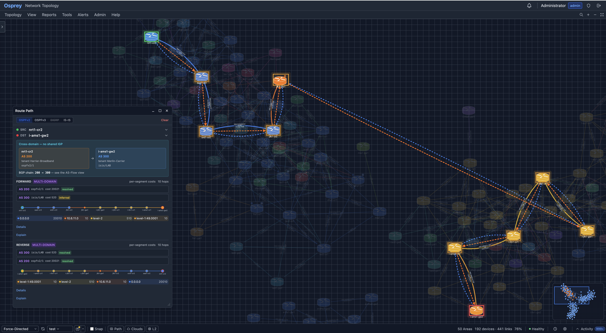
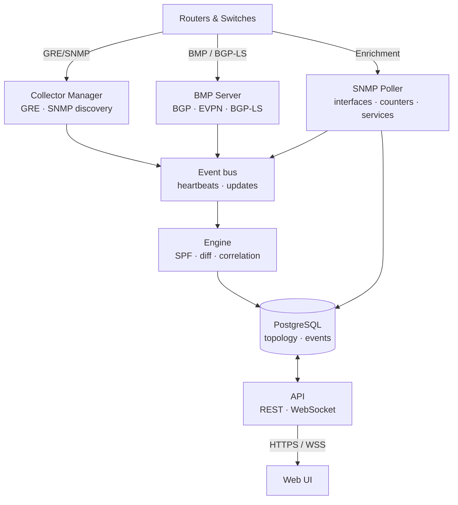

# Osprey

**Network visibility and troubleshooting for OSPF, IS-IS, EIGRP, BGP, MPLS, and EVPN**

Osprey brings topology, routing data, traffic measurements, and history into one
web interface. Use it to investigate outages, follow paths across routing domains,
and assess planned changes using the data available from your network.
No software agents are installed on routers, and Osprey does not advertise routes
through BGP or forward user traffic.

[Website](https://www.wijnberg.net/) ·
[Documentation](https://www.wijnberg.net/docs/) ·
[Download](https://github.com/wijnberg-net/osprey/releases/latest) ·
[Licensing](mailto:sales@wijnberg.net)

---



## Why Osprey

Investigating a routing change often means comparing CLI output from several
routers, matching timestamps, and working out which services were affected.
Osprey puts those observations on a shared topology and timeline, so engineers
can investigate the network without repeatedly assembling the same context.

Osprey collects OSPF and IS-IS link-state data through GRE adjacencies, SNMP,
or router exports using BGP-LS. It reads EIGRP topology tables through SNMP
and BGP routing updates through BMP. Path analysis uses protocol calculations
and per-router route evidence where available, with the method and limitations
shown alongside the result.

- **Assess a change before applying it.** Simulate link or device failures,
  adjust metrics, or fail a shared-risk link group (SRLG). Review predicted
  path changes, isolation, and congestion risk without changing the live network.
- **Investigate past events.** Use Time Travel to replay retained observations,
  compare before and after states, and inspect related incidents. Historical
  answers depend on the data recorded for the selected time, not retention alone.
- **Follow paths across protocols.** Combine OSPFv2, OSPFv3, IS-IS, EIGRP,
  BGP and L2 information on one canvas. IS-IS calculations are separate for
  IPv4, IPv6, and CLNS. Search the BGP paths received from all configured BMP
  sources in one view, rather than checking each router separately.
- **Use router-exported topology.** Where direct IGP collection is unavailable,
  BGP-LS can provide exported topology through BMP or a direct BGP session.
  Device and link details identify the source, so an exported view is not
  presented as a directly recorded link-state database.
- **Connect routing changes with services.** Replay BGP path changes, compare
  two points on the AS-flow timeline, and inspect individual autonomous systems.
  MPLS tunnels, L3VPNs, VPWS/VPLS services, and EVPN membership can be overlaid
  on the topology. Service overlays show their recorded relationships and state;
  they do not by themselves prove where packets travel or what caused an outage.

### How Osprey connects to your network

SNMP collectors read protocol tables, interface counters, and neighbor information.
BMP sources send BGP routing updates to Osprey. For direct BGP-LS collection,
Osprey initiates the BGP connection and receives link-state information. It sends
the messages needed to maintain that session, but **does not advertise routes**.

GRE collection forms an actual IGP adjacency. These collectors appear in the
link-state database and exchange protocol traffic; they are not invisible to
the network. OSPF collectors advertise high link costs, and IS-IS collectors set
the overload bit to discourage transit use. Osprey is an observer, not a packet
forwarder. Collection still requires appropriate router configuration and uses
management or control-plane resources.

Source availability matters. A populated map does not guarantee that every route,
address family, or historical interval is covered. Path details identify inferred
or unresolved sections where the available observations do not support an answer.

---

## Download & install

Grab the latest `.deb` from the
[Releases page](https://github.com/wijnberg-net/osprey/releases/latest), verify it,
and install:

```bash
# Download the latest release + checksum
curl -LO https://github.com/wijnberg-net/osprey/releases/latest/download/osprey_amd64.deb
curl -LO https://github.com/wijnberg-net/osprey/releases/latest/download/SHA256SUMS

# Verify integrity
sha256sum -c SHA256SUMS

# Install with PostgreSQL, NATS, and nginx as dependencies
sudo apt install ./osprey_amd64.deb
```

Migrations run automatically, all services start under systemd, and a self-signed
TLS certificate is generated on first install. Open **https://your-server/** and log
in with the admin account created during setup.

**Supported platforms:** Debian 12+, Ubuntu 24.04+. Runs on bare metal, Proxmox LXC
(privileged and unprivileged), and VMs.

### Free evaluation

All features, up to 32 devices, no time limit, no license key required. Upgrade by
uploading a license key through the web UI. For Professional or Enterprise
licensing, contact **[sales@wijnberg.net](mailto:sales@wijnberg.net)**.

Exceeding the device limit or reaching paid-license expiry starts a 30-day grace
period with unrestricted operation. Afterward, existing devices remain monitored:
topology, paths, alerts, reports, and live updates stay available. New devices are
refused only when they exceed the applicable limit. Removing a device frees a slot;
an address or identifier change does not consume another slot when Osprey can
match it to the existing device.

---

## Protocol support

| Protocol   | Discovery method   | Capabilities |
|------------|--------------------|--------------|
| **OSPFv2** | GRE adjacency, SNMP, BGP-LS | LSDB inspection for direct collection, SPF, inter-area and external routes; interface traffic through SNMP |
| **OSPFv3** | GRE adjacency, SNMP, BGP-LS | LSDB inspection for direct collection, dual-stack topology, RFC 5838 address families |
| **IS-IS**  | GRE adjacency, SNMP, BGP-LS | LSDB inspection for direct collection, CLNS/IPv4/IPv6 path analysis, SR-MPLS, multi-area discovery from a single seed, scoped area recorders, Cisco IOS GRE support |
| **EIGRP**  | SNMP (CISCO-EIGRP-MIB) | IPv4/IPv6 neighbor, interface and topology-table discovery; classic and named mode, VRF/AS scoping, observed route metrics and next hops, L2 integration, administrative-distance selection and adjacency-loss alerts. Cisco only; no EIGRP adjacency required |
| **BGP**    | BMP (RFC 7854)      | Received routing tables and candidate paths, ADD-PATH, peer state, historical replay and AS-flow animation |
| **BGP-LS** | BMP or direct BGP session (RFC 9552) | Router-exported topology with source attribution; direct area collection takes precedence. Incomplete collection is reported, and topology is withheld when source-completeness checks fail |
| **EVPN**   | BMP (RFC 7854)      | EVPN routes (RFC 7432), E-LAN & EVPN-VPWS instances (VXLAN or MPLS), member PEs with MAC/IP counts, Ethernet segments, MAC-mobility & PE-loss detection |
| **MPLS**   | SNMP (MPLS-TE / L3VPN / PW MIBs) | TE tunnels (RFC 3812), L3VPNs grouped by VRF and route-target data (RFC 4364 / 4382), VPWS connections and VPLS instances from pseudowire data (RFC 5601) |
| **L2**     | SNMP (LLDP/CDP)     | Switch adjacencies, neighbor-based discovery, overlay on IGP topology |

Capabilities depend on the source, device software, and enabled router features.
BGP-LS exports are not equivalent to a complete raw LSDB, and BMP exposes the
routes its exporters provide. A supported protocol does not imply that every
device exposes every table or address family.

IS-IS multi-area discovery is enabled per recorder. Automatic handoff to
per-area SNMP recorders is a separate, default-off option: it requires both
the server's `snmp.isis_bootstrap_enabled` setting (with a collector-manager
restart) and the parent recorder's **Bootstrap strict per-area recorders** option.

---

## Features

### Topology visualization

- Interactive canvas with area coloring, vendor icons, and real-time updates
- Three built-in icon packs with area coloring, including Osprey 3D icons that show device roles
- Area-cloud overview for large multi-area topologies, expandable in place to drill down
- Desktop-style panel manager: compare devices and links side-by-side without losing context
- Multi-protocol link merge: OSPFv2, OSPFv3, IS-IS, and EIGRP on the same wire shown as one edge with per-protocol detail
- L2 overlay: LLDP/CDP switch adjacencies rendered alongside IGP topology
- Device and link details show whether information came from a link-state database, SNMP, or a router export
- Export to Visio (.vsdx), PNG and SVG, with support for curved links, labels and area boundaries; import vendor stencil packs for device icons
- Multiple visual themes, including dark, high contrast, and retro
- Responsive layout for phones and tablets; the desktop layout is unchanged

### Traffic monitoring

- SNMP v2c/v3 polling: per-interface utilization, errors, bandwidth, vendor detection
- On-demand 10-second boost polling when inspecting a link
- Traffic graphs with hourly history and 24h, 7d and 30d viewing windows
- Congestion and error alerting with sustained-sample filtering

### Route analysis

- **Hop-by-hop route analysis.** Follow each router's own route decision where
  per-router evidence is available. Where supported, a shortest-path calculation
  provides a labelled fallback, including for some OSPFv3, IS-IS and partial-scope
  queries. Hop details show metrics, route types and installed equal-cost next
  hops where known. This is routing analysis, not a packet-delivery test.
- **Cross-domain paths.** Connect IGP segments across autonomous systems and
  tenants using BGP evidence. Each segment shows its cost and whether the
  transition is resolved, inferred or unresolved.
- Shortest-path computation with the full equal-cost path set and asymmetric-routing detection
- IS-IS address-family selector with separate path views; CLNS displays System IDs and NETs
- SR-MPLS label-stack computation (RFC 8667)
- Per-router routing table with step-by-step cost explanation
- BGP prefix search (exact, longest-match, covered) with CSV export
- SPF tree visualization from any device with cost annotations

### BGP analysis

- Search received routes across all BMP sources, including candidate paths,
  ADD-PATH and best-path selection. The view is limited to what those sources export.
- Explore the AS-Flow graph, replay changes and compare two times. Per-AS details
  include route share, churn, primary and backup dependencies, exit routers and
  session health. The view aggregates full-table data rather than drawing a node
  for every prefix.
- Replay a prefix's best-path history to follow exit changes and session events.
- Use historical route and session data to assess hot-potato exit changes and
  peer-failure impact at the selected time, subject to recorded coverage.
- **BGP security findings.** Check received paths for multiple origins, a
  more-specific prefix under another origin's covering prefix, and paths already
  containing your own AS. Findings identify the sessions that supplied them.
  They are observations, not automatic hijack diagnoses; an empty report with
  incomplete coverage is not an all-clear.
- **Route-origin validation.** Import an RPKI/ROA authorization set to label
  received paths valid, invalid or unknown under RFC 6811. Historical candidates
  use the recorded authorization state for that time. No validation badge is
  shown when no ROAs have been loaded; Osprey does not run an RTR service.
- Peer session monitoring via BMP with up/down history and per-target prefix counts

### MPLS & EVPN service visibility

- **MPLS-TE tunnels:** inspect head, transit and tail roles, administrative and
  operational state, and a headend-to-tailend connection on the canvas. This
  overview does not trace the tunnel's individual forwarding hops.
- **L3VPNs:** group per-PE VRFs by route-target relationships, with full-mesh or
  hub-and-spoke classification and site roles.
- **VPWS and VPLS:** discover pseudowires through standard or supported Cisco
  MIBs and combine their endpoints into services. A VPWS connection is marked
  incomplete when its far end is not observed. VPLS shows full, partial or unknown
  mesh coverage. Both have service panels and topology overlays.
- **EVPN:** discover E-LAN and EVPN-VPWS instances from BMP, using VXLAN or MPLS.
  Duplicate observations from route reflectors are combined. Inspect member PEs,
  per-PE MAC/IP counts, Ethernet Segments and devices outside the current map.
- **EVPN changes:** correlate MAC-mobility and PE-loss symptoms with device or
  link incidents. Detection distinguishes MAC moves from all-active multihoming
  and limits event bursts. These symptoms do not independently open incidents.
- **Service overlays:** highlight member PEs and their relationships, using mesh
  or hub-and-spoke layouts where supported. The display distinguishes complete,
  partial and unavailable observations. Membership links describe the control
  plane, not the path taken by a packet.
- **Controlled discovery:** MPLS discovery is enabled per network and is off by
  default. Capability checks limit which tables are walked. Tunnel, VRF and
  pseudowire changes contribute symptoms to incident correlation, rather than
  being treated as established root causes.

### Failure simulation

- Simulate link failures, node removals, metric changes, hypothetical links/routers, SRLG failures
- Cross-domain scenarios retain the BGP-linked path and apply changes to the
  affected link-state segments. For EIGRP, Osprey can use a surviving installed
  next hop when one is available. It reports when none survives; it does not
  predict a new DUAL calculation.
- Traffic-shift impact analysis with congestion-risk classification
- Batch assessment: iterate all links or nodes, surface only failures that cause isolation
- Shareable scenarios with undo/redo, applicable to historical snapshots via time travel

### History and diagnostics

- Time Travel with playback controls and timeline scrubber, bounded by the configured snapshot retention window
- Topology Diff: compare two points in time with an added/removed/changed summary
- Incident-correlation engine: related events grouped with inferred root causes
- LSDB browser with LSA headers, age indicators, and Options-flag decoding
- Diagnostic reports: timer consistency, MTU mismatch, congestion trends, routing stability, single points of failure

### Administration

- Enterprise sign-on with OpenID Connect, LDAP / Active Directory and SAML 2.0;
  SCIM 2.0 user provisioning and TOTP two-factor authentication for local accounts
- Role-based access control (admin, engineer, operator)
- Browser-based SSH/Telnet terminal with admin-enabled session recording,
  encrypted at rest on standard package installations, and audit logging
- Alert rules with Slack, Teams, email, and webhook notifications
- Maintenance windows for scheduled alert suppression
- SNMP credential profiles with per-network overrides and fallback credentials
- Backup/restore, audit logging, encrypted credential storage, license management
- Update notification: checks for a newer release on startup and prompts when one is available

Identity-provider integration acceptance testing is still pending. Validate
sign-in, group-to-role mapping and provisioning with your provider before rollout.

---

## Architecture

A single binary runs five services under `osprey.target`:



The diagram shows the main collection and presentation paths. Collectors publish
topology observations through NATS for the engine to process and store. SNMP
enrichment also writes interface, neighbor and service data directly to PostgreSQL.
The API reads stored data, handles configuration changes and streams live updates
to the browser. Services also use the database for configuration and operational
state; the diagram does not show every control or notification message.

PostgreSQL is the primary datastore. NATS carries messages between services.
The installation does not require a JVM, Elasticsearch or a graph database.

## Scale

Capacity depends on device and interface counts, route volume, update frequency,
retention settings and server resources. Browser performance is a separate
consideration: the number of visible elements, labels, display resolution and
client hardware affect how smoothly a topology can be explored. There is no
single device count that describes all of these limits.

Use area views to focus on the part of a large network you are investigating.
This reduces what is displayed, but does not necessarily reduce all data already
loaded by the browser. Size and test an installation against its intended workload
rather than treating a full-network canvas as the only measure of capacity.

SNMP counter polling defaults to five-minute intervals, with configurable
per-target overrides. Interface discovery defaults to a six-hour cycle.
Shorter intervals provide more frequent observations at a higher collection cost.

---

## Documentation

The [documentation](https://www.wijnberg.net/docs/) covers installation, topology
views, reports, simulation, administration and troubleshooting. Start there for
router configuration requirements and guidance on interpreting collected data.

---

## License

Proprietary. Copyright © 2025–2026 Michel Wijnberg. All rights reserved. See
[LICENSE](LICENSE).

Free evaluation: all features, up to 32 devices, no time limit. Commercial
licensing: **[sales@wijnberg.net](mailto:sales@wijnberg.net)**. Full terms:
[www.wijnberg.net/terms](https://www.wijnberg.net/terms/).

The distributed binary includes third-party open-source components under their
respective licenses; see [THIRD-PARTY-LICENSES.txt](THIRD-PARTY-LICENSES.txt).

<details>
<summary>Protocol references</summary>

**OSPF**: RFC 2328 (v2), RFC 5340 (v3), RFC 5838 (AF extensions), RFC 5709 (HMAC-SHA authentication), RFC 7474 (manual-key security extension).
**IS-IS**: ISO 10589, RFC 1195, RFC 5301 (hostname), RFC 5303 (3-way), RFC 5305 (TE), RFC 8667 (SR-MPLS).
**BGP/BMP**: RFC 4271 (BGP-4), RFC 4760 (MP-BGP), RFC 6793 (4-byte ASN), RFC 7854 (BMP), RFC 7911 (Add-Path), RFC 8654 (Extended Messages), RFC 9552 (BGP-LS).
**EVPN**: RFC 7432 (BGP MPLS-Based Ethernet VPN), RFC 8214 (EVPN-VPWS), RFC 8365 (network virtualization overlays / VXLAN).
**MPLS**: RFC 3812 (TE MIB), RFC 4364 (BGP/MPLS IP VPNs), RFC 4382 (L3VPN MIB), RFC 5601 (PW-STD-MIB).
**RPKI**: RFC 6482 (ROA), RFC 6811 (origin validation), RFC 6483 (validation semantics, including AS0 ROAs).
**AS0 in BGP**: RFC 7607 (handling AS number zero in BGP messages).
**L2**: IEEE 802.1AB (LLDP), Cisco CDP.

</details>
